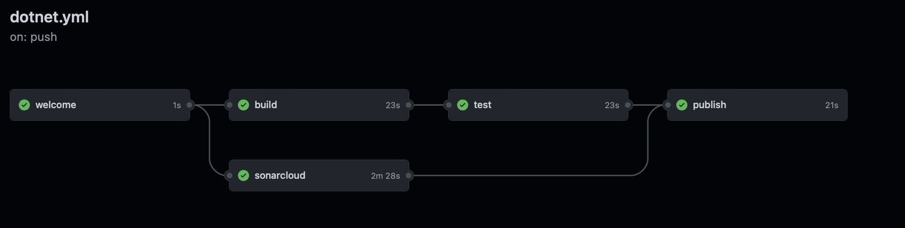

This repo holds basic app with some unit tests to demonstrate basic usage of the Github Actions with .NET project.

## Steps
This section describes steps to implement basic Github Actions workflow with .NET project.

### Preparation

1. Fork this repository and clone your repository to be able to modify content of the repository.
2. Create new branch from main branch.
3. Create empty file .github/workflows/dotnet.yml
4. Commit and push your changes to the remote repository.
5. Create PR from your branch to main branch.

### Tasks

1. Create workflow with basic action that prints out welcome message

2. Extend workflow with steps for dotnet build, test and publish
    * run on main / master branch and pull requests
    * use the descriptive naming for the jobs
    * modelate relations between jobs as visualized below

3. (Optional) Extend workflow with step performing static analysis of your code using sonarcloud
    * Create free account on [sonarcloud](https://sonarcloud.io/)
    * Allow Sonarcloud as application with access to Github
    * Follow steps to integrate Sonarcloud and Github using Github actions
    * Replace placeholder for build command with your build command
    * Check analysis results on pull request detail screen and sonarcloud dashboard
    * Put badge with analysis results to your README

_Disclaimer:_ Set-up of the workflow is not the best one nor the correct one. It is used to demonstrate basics of the Github Actions and workflow definition. Some jobs can be merged to one, caching may be used or e.g. tests results may be reported.
